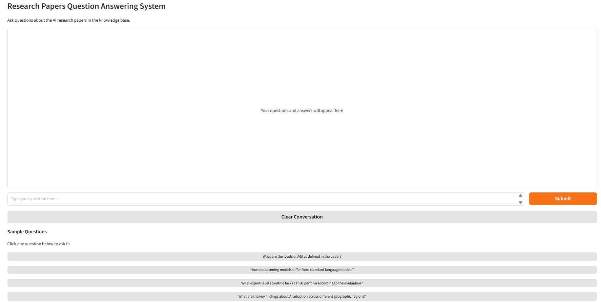
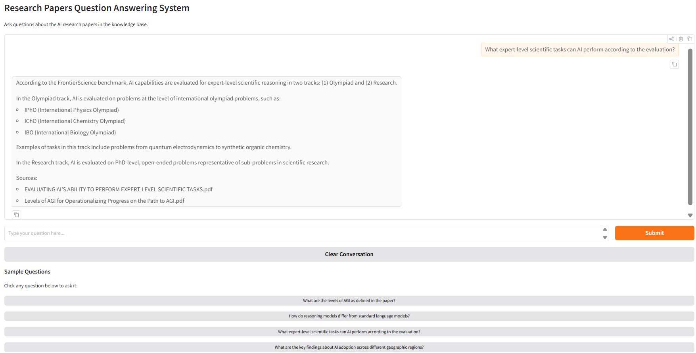

# AI Research Papers RAG Chatbot
Local Retrieval-Augmented Generation chatbot for querying 7 cutting-edge AI research papers using Ollama and LangChain.

**Live Demo**
- Run locally

**Chatbot interface showing the main chat window with sample inputs.**

**Sample query and response with retrieved source citations.**

## Key Features
- Offline inference with Llama 3.1 8B
- FAISS vector store with sentence-transformer embeddings
- FAISS vector store for fast retrieval
- Source citations from PDFs
- Gradio UI with sample questions

## Tech Stack
- LangChain
- Ollama (Llama 3.1 8B)
- FAISS (vector store)
- sentence-transformers/all-MiniLM-L6-v2 (embeddings)
- Gradio (frontend)
- PyPDF (PDF loading)

## Setup
1. Install Ollama: https://ollama.com/download
2. Pull model: `ollama pull llama3.1:8b`
3. Create virtual environment:
   python -m venv venv
   venv\Scripts\activate
4. Install dependencies:
   pip install -r requirements.txt
5. Place your PDF files in the data/ folder
6. Run the app:
   run app.py
7. Open http://127.0.0.1:7860 in your browser
